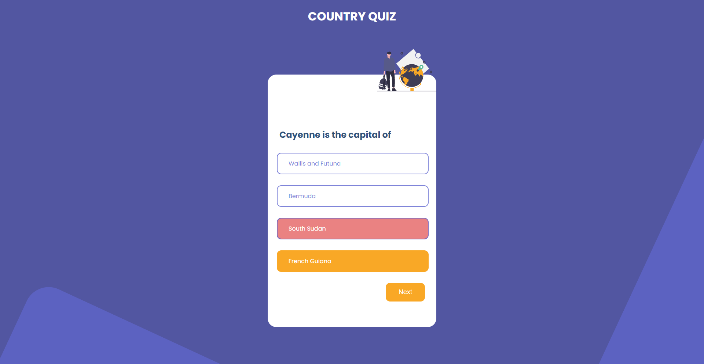
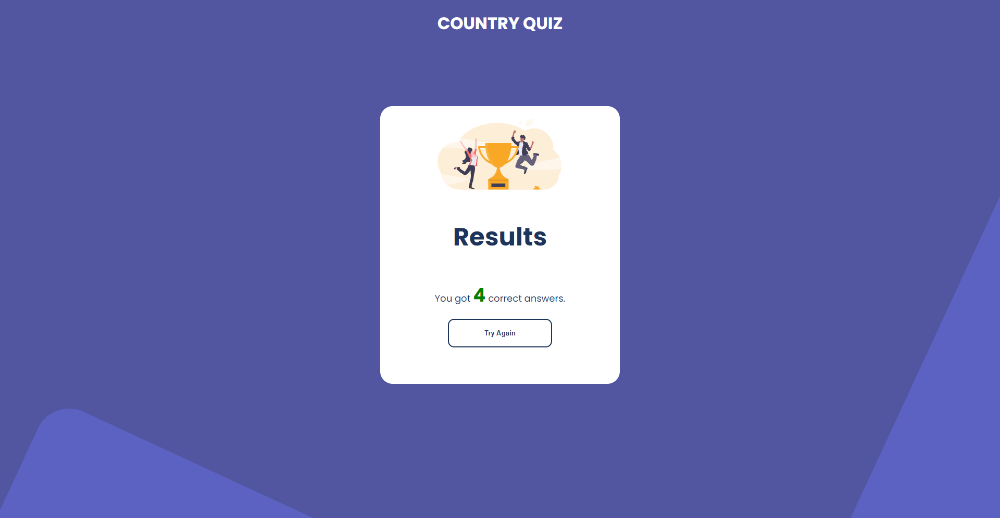

# Country Quiz

A quiz application which you can test your knowledge about countries all around the world.

# Answering

[](/)

# Result

[](/)

## Project setup

```
npm install
```

### Compiles and hot-reloads for development

```
npm run serve
```

### Compiles and minifies for production

```
npm run build
```

### Customize configuration

See [Configuration Reference](https://cli.vuejs.org/config/).
